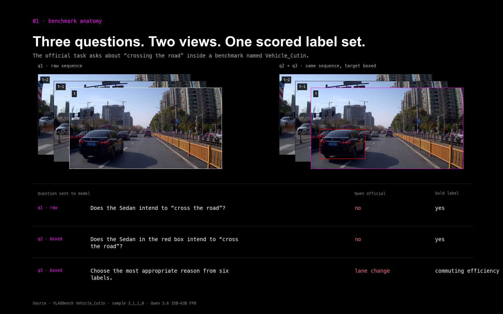
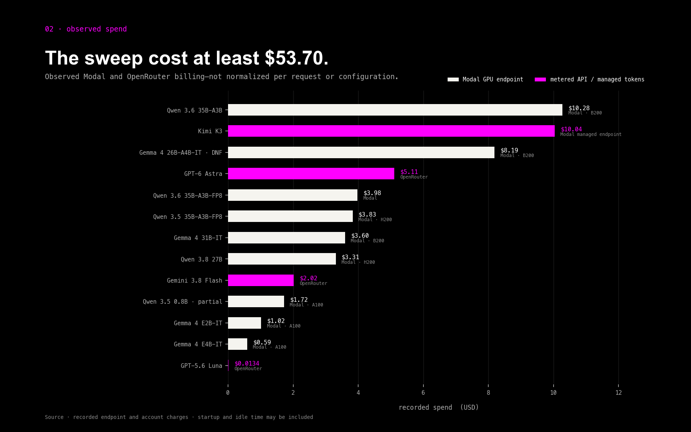
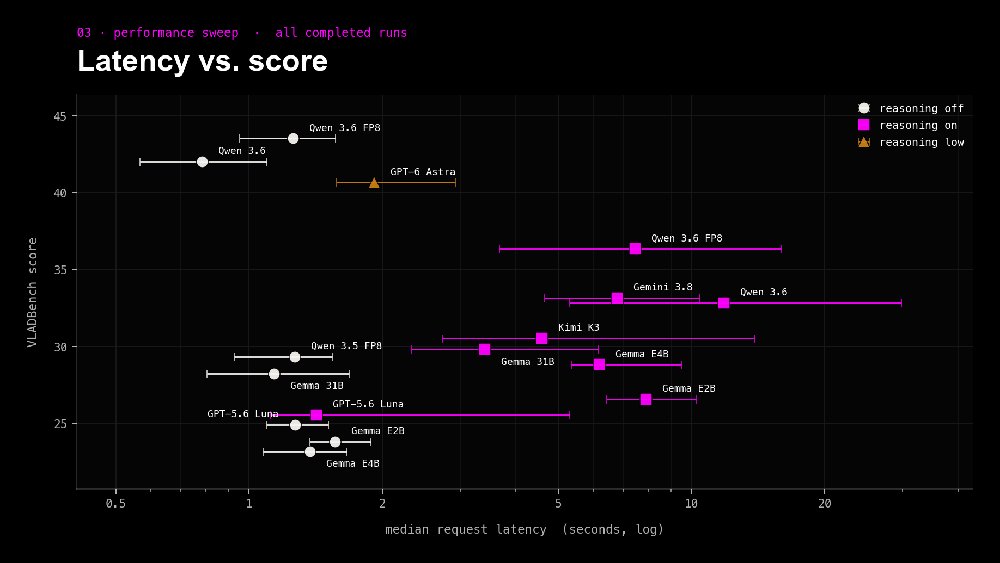
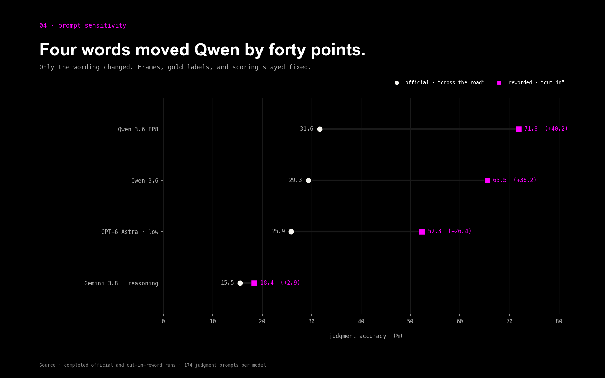
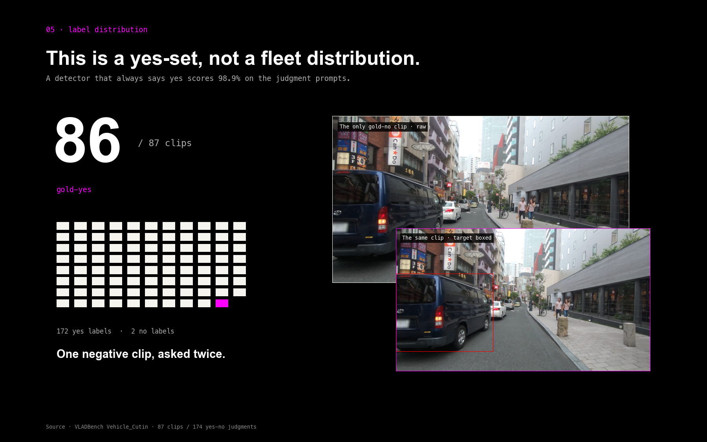
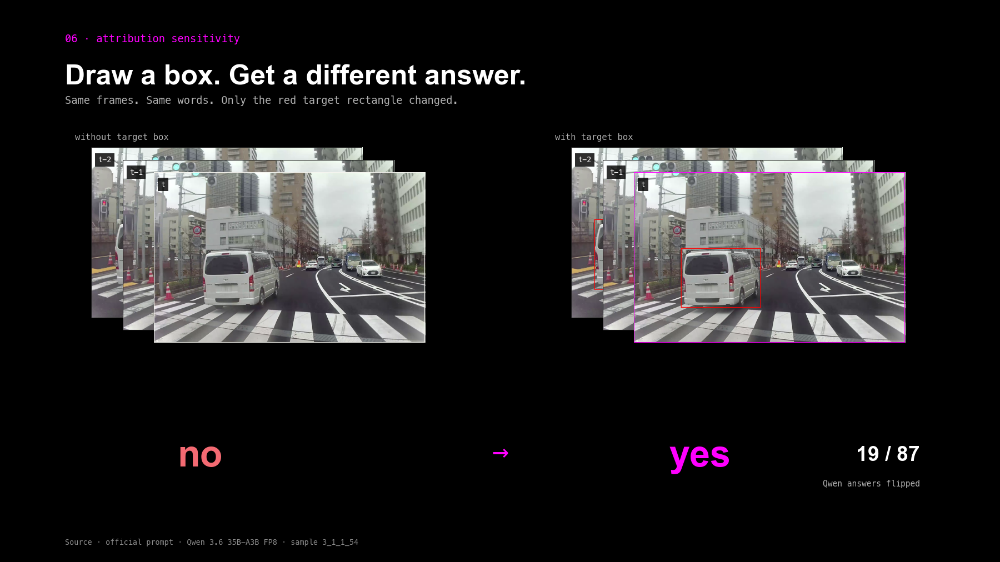
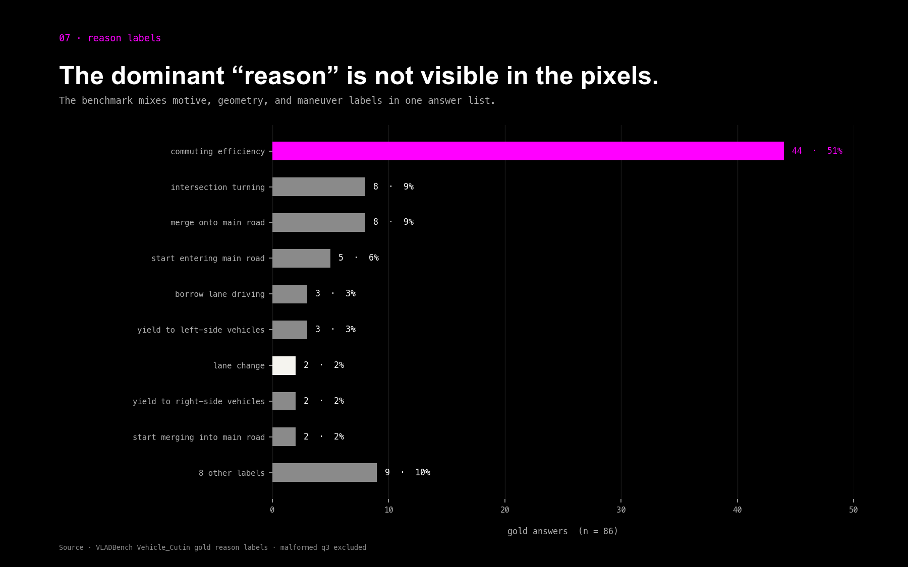

# Open-loop VLM evals are a disappointing proxy for scenario mining.

> **TLDR**
>
> After running 20 completed configurations across 12 VLMs on a vehicle cut-in visual-question-answering task, I re-discovered eight expensive assumptions that ruin robotics evals. Qwen 3.6 35B-A3B topped this harness, but prompt wording, bounding boxes, and a 98.9%-positive label set moved the result enough that the benchmark could not establish production cut-in performance.

---

## VLMs can't save your evals.

Every new customer conversation is the same.

A robotics team tries to use a frontier model to find scenarios in fleet video only to be disappointed with the results. Frontier models have improved drastically over the last year, so I decided I'd revisit a benchmark from last year to see just how good today's models have become.

Turns out the model is a distraction and an expensive one at that.

I ended up testing 20 completed configurations across 12 models on VLADBench's Vehicle Cut-in VQA task and discovered that the task prompt was misleading in English, and that the *reason* attribution was being scored against a label I didn't care about. But these were the concrete failures I encountered on VLADBench. What struck me this time was just how ...

On a task that looks trivially easy, prompting a vision language model open-loop over a few frames is brittle and highly sensitive to prompt variations and bounding box annotations. I'll also caveat that

> **Note:**
>
> [Bench2Drive-VL](https://arxiv.org/abs/2604.01259) (April 2026) is a closed-loop benchmark from a separate research group. It is not VLADBench's direct follow-up; I use it later as a contrast with open-loop VQA.

A bit of background before we dive in...

AV (Autonomous Vehicle) safety teams leverage a combination of techniques to annotate scenes. The naive promise of frontier VLMs is that you can replace human annotations with machine-generated pseudo-labels. We might be able to solve Navier–Stokes, but this harness could not establish that even GPT-6 Astra detects cut-ins accurately enough to train your next policy.

Detecting vehicle cut-ins is an important scenario in self-driving. A lane change begins when another vehicle crosses a lane boundary; it becomes an ego-relevant cut-in when that vehicle enters the gap ahead of the ego vehicle in its lane or planned path, usually reducing headway and potentially requiring an ego response. There is no single ISO definition that everyone cites, but a cut-in is more specific than simply crossing a dashed line.

## The VLADBench Cut-ins Benchmark

[VLADBench](https://arxiv.org/abs/2503.21505) (ICCV 2025) is an autonomous-driving benchmark spanning 29 closed-form driving tasks. The paper emphasizes that most autonomous driving evaluations bucket capability too broadly, which is the motivation for expanding to fine-grained task suites. I chose to focus on the *Vehicle Cut-in* task, which poses 260 questions against 87 dashcam clips.

"Clips" is generous here. We're not actually shoving video. The VLM is provided with a sequence of two to seven still images and is asked to classify whether or not the scene qualifies as a cut-in. Each model is asked twice, once with just the raw frames, and again with a bounding box around the vehicle of interest, with a simple yes or no. A third question asks the VLM to attribute the reasoning label from a predefined list—basically just structured outputs.

I looked at this task and was like, "Cool, let's see how many models I can run this benchmark on in the next two hours," and swept 20 completed configurations across 12 open and closed models, with and without reasoning.

## The disappointing results.

The initial survey placed Qwen 3.6 35B-A3B at the top of the official composite score and among the fastest completed configurations. A score of 43.5 out of 100 shows there's still plenty of headroom for improvement. Because the endpoint totals cover different numbers of runs and hardware, this experiment does not establish a normalized cost winner.

The sweep generated at least $53.70 in recorded Modal and OpenRouter charges. These are account-level experiment totals, not normalized model prices: some entries cover more configurations than others, and Modal GPU time may include startup and idle time. Treat this as the observed cost of finding the harness failures, not a price comparison.

Use the result to compare behavior on this harness; do not use it to decide whether cut-in detection is solved.

Now here is how this actually went:

**The prompt was misleading.** While the task is called `Vehicle_Cutin`, the prompt the model actually receives is:

> does the Sedan in the image have the intention to **cross the road**?

Almost all of the clips show a vehicle moving laterally across or toward a dashed lane marking. Crossing that marking is a lane change; it becomes a cut-in when the vehicle enters the gap ahead of ego. In ordinary English, "cross the road" instead suggests traversing a roadway, often at an intersection.

**The Score isn't a proxy for Cut-in detection**. The official composite score from the paper is calculated as 70% yes/no judgment, 10% reason, 20% "did you copy an option from the question."

**The goldens were 98.9% positives**, so an always-yes classifier achieves 98.9% judgment accuracy.

**Intent labels are unverifiable** — you can't recover why a driver merged from three frames, so "commuter efficiency" as a gold answer is scoring the model against a guess. And it isn't what a scenario miner needs anyway; they need what happened and where, not motive.

Qwen 3.6 35B-A3B, quantized to FP8, led the completed official run on judgment accuracy. GPT-6 was close on composite score but slower in this run. The plot includes every completed configuration with timing metadata; with one run per configuration, I do not have enough evidence to explain why Qwen 3.8 scored below Qwen 3.6.

Turning reasoning on did not help the models that were already ahead. Qwen FP8 dropped from 31.6% judgment to 20.7%. The extra thinking made it more literal, not more visual. That is the first failure mode, and we found it before we changed a word of the prompt.

Relative ranking across a large sweep is operationally more useful than a single heroic run on one model. We ran each configuration once. I am not going to pretend that is a confidence interval. It is enough to choose which configurations deserve replication, not to make a production claim.

## Then we read the prompt

While the task is called `Vehicle_Cutin`, the prompt the model actually receives is:

> does the Sedan in the image have the intention to **cross the road**?

Almost all of the clips show a vehicle moving laterally across or toward a dashed lane marking. Crossing that marking is a lane change; it becomes a cut-in when the vehicle enters the gap ahead of ego. The official English prompt names a different maneuver.

Gold says yes on 172 of 174 judgment questions. A model that reads English and says no is "wrong." The official leaderboard is partly a ranking of who is willing to ignore the sentence.

That does not make the sweep worthless. It makes the absolute numbers too low, and it makes "thinking" look like a penalty. We reworded one phrase for the top of the board — "intend to cut in (enter or cross into the ego vehicle's path)" — and left gold, frames, and scoring alone.

| Model               | Judgment, official | Judgment, reworded | False positives |
| ------------------- | ------------------ | ------------------ | --------------- |
| Qwen3.6-35B-A3B-FP8 | 31.6%              | 71.8%              | 0 → 1           |
| Qwen3.6-35B-A3B     | 29.3%              | 65.5%              | —               |
| GPT-6 Astra         | 25.9%              | 52.3%              | 0 → 0           |
| Gemini 3.8 Flash    | 15.5%              | 18.4%              | 0 → 0           |

The order of the models we re-ran did not change. Qwen FP8, then Qwen, then GPT-6, then Gemini. If you came to this task to pick a model, that ranking is the thing that survived. The scores did not. Four words moved Qwen by forty points. Gemini barely moved. Specificity is not a style choice. It is a hyperparameter, it does not transfer across vendors, and on a fleet you will not have a folder name to warn you that the prompt is almost the right question.

I am not going to relabel the gold to make anyone look better. The ranking held. The magnitudes did not. Both of those facts matter.

## The yes-set problem

The reworded Qwen number looks like a pass. 71.8% judgment, 71.1 composite, one false positive. Then you count the labels. 86 of 87 clips are gold-yes. There is one true-negative clip, asked twice. A detector that became more willing to say yes will look improved. We did not get a hard negative set. We cannot tell a careful cut-in detector from a model that stopped saying no.

If you mine ambient fleet video, almost every frame is a negative. This benchmark cannot tell you what that costs. Precision on a yes-heavy eval is not precision in the field. The false-positive column staying near zero is comforting until you notice there was almost nothing to be wrong about.

## Draw a box, get a different answer

Each clip is asked twice: raw frames, then the same frames with the target in a red rectangle. Same sentence.

GPT-6 got worse with the box (27.6% → 24.1% on the official wording; 55.2% → 49.4% after the reword). Qwen got better, especially after the reword (65.5% → 78.2%). Gemini moved around. What did not stay still was the decision. Qwen flipped yes/no on 19 of 87 clips when the rectangle appeared; after the reword, 23. GPT-6 flipped on 7, then 19.

We have seen the drop internally as well: turn localization on, performance moves, usually not in the direction you budgeted for. In a fleet pipeline the box is your detector. You are now paying for a VLM *and* a localizer, and the VLM's answer depends on whether the localizer fired and how tight the box was. Attribution is not a free hint. It is another place the system is brittle.

That is a large part of why throwing a VLM at ambient logs is expensive. You do not just pay per token. You pay for a prompt you cannot validate, a box you may need, and a miss rate you cannot see.

## Then we tried to grade "why"

The third question asserts the cut-in and asks for a reason from a short list. The most common gold reason, 44 of 86 scored clips, is `commuting efficiency`. It is not defined in the paper, the supplement, or the JSON. It is a motive: they moved into ego's path to get ahead. You cannot see that in a last frame. You can see a Honda on a dashed line. The models say `lane change`. Gold uses `lane change` twice.

This is the point where I got angry at the benchmark as a grading instrument, not just as a prompt. Cut-in is hard to see. Explaining it in a taxonomy that mixes geometry (`merge onto main road`) with unobservable intent is harder. We did not "correct" those golds to `lane change`. That would be fitting labels to the predictions we already had. What we can say is: once the English was honest, GPT-6's reason accuracy fell (25.6% → 18.6%) and the number of clips it got fully right — yes, yes, and the canned reason — fell from 13 to 7. With the broken prompt it had been matching the benchmark's favorite phrase. Ask the real question and the reason head falls apart.

Designing the eval is the job. If the classes are not in the pixels, you are not measuring perception.

## What the authors did next

The VLADBench paper does not publish a postmortem on this task. Three months later, an overlapping author group (including Yue Li and Meng Tian) put out [Drive-R1](https://arxiv.org/abs/2506.18234) (AAAI 2026). The question there is no longer "did the VLM answer the VQA." The opening result is a planner that does as well or better without camera data. The model was using history and ego state, not the image. They evaluate on nuScenes and DriveLM, not on VLADBench.

That later paper is not a VLADBench postmortem, but it demonstrates the broader risk: open-loop visual question answering can look like understanding while the model is not looking. Separately, [Bench2Drive-VL](https://arxiv.org/abs/2604.01259) (April 2026), from a different research group, contrasts closed-loop evaluation with the previous generation of open-loop VQA. VLADBench's own limitations section is narrower. It asks for multi-view and better domain training. It does not ask whether the questions are the task.

I went to VLADBench to pick a model. The later papers investigate different evaluation problems; they do not prove why the authors changed direction. My narrower finding is that this VQA task was not a stable measurement of cut-in detection.

## I am disappointed in both

I am disappointed in most of the vision stack we swept for this job. Below the top five, do not use these models to find cut-ins. Gemma E2B, Gemma E4B, GPT-5.6 Luna, Qwen 3.8 without thinking, the fine-tune: they are not close. If you start anywhere, start with Qwen 3.6 35B-A3B. Not because it solved the problem. Because it is the cheapest way to spend the rest of your compute hitting the failure modes below instead of rediscovering that a 2B model cannot do this.

I am also disappointed in the top five. They are the ones worth experimenting with, and they are painfully sensitive to the prompt, the box, and the label taxonomy. Qwen is the winner on this harness. It is not a cut-in system.

I am disappointed in the benchmark. The English did not name the task. The classes mixed what you can see with what you cannot. The yes/no split is a cartoon of the fleet. A year-old ICCV paper is allowed to be messy. Using it as a silent production filter is how you ship a miner that looks clean and misses most of the events.

Both can be true. A bad eval does not automatically mean the ranking is bad. Ours held after we fixed the English. It does mean you should not believe the score.

## A list of ways not to do this

I failed so you don't have to. From the most naive to least, try to avoid these assumptions when working with your fleet logs:

1. **Do not treat scoring as a model pick without reading the question.** If the prompt does not reflect the scenario, you are ranking overfit results, not perception. The scenario is a spec worth spending time on.
2. **Do not assume the prompt wording transfers across models.** Four words, forty points on Qwen, almost nothing on Gemini. Write the question you mean. Test it on every vendor.
3. **Do not turn on chain-of-thought and assume vision improved.** On this task, thinking almost always made the leader more literal and worsened scores.
4. **Do not trust a high pass rate on a yes-set.** 86 of 87 clips here are positives. Fleet video is the opposite. You have not measured the false-alarm cost.
5. **Do not treat a bounding box as a free accuracy boost.** Answers change. Sometimes they get worse. You now depend on a detector you may not have.
6. **Do not put motives in the taxonomy.** `commuting efficiency` is not a visual class. `lane change` is. Grade what is in the frame.
7. **Do not skip the sweep.** One model on one prompt is just one datapoint. Sweeping twenty configurations told us which models to ignore.
8. **Do not use open-loop VQA as a proxy for scenario mining.** This task did not establish whether the model actually used the image, and separate closed-loop work measures behavior much further from a yes/no over a handful of JPEGs.

Detecting cut-ins is hard. Writing a perception benchmark for them, especially one that goes through a vision-language model, is harder. The value of the last two days is not a template for evaluating cut-ins open-loop; it is evidence that benchmark design dominated the result. If you build the next experiment, Qwen 3.6 35B-A3B is a reasonable starting point on this harness—not proof of production performance—and the evaluation design deserves at least as much attention as the model.