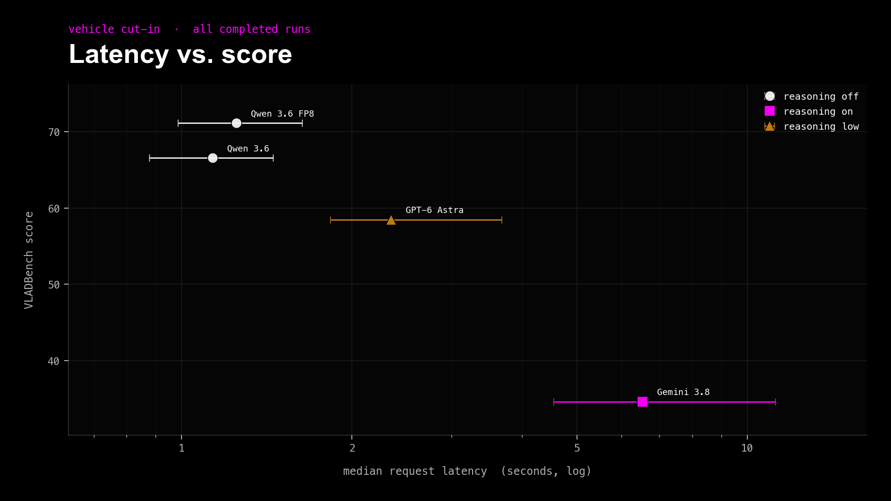
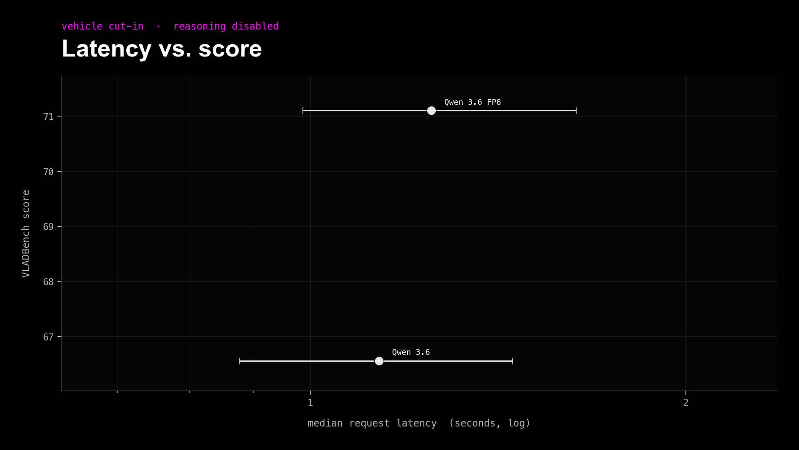
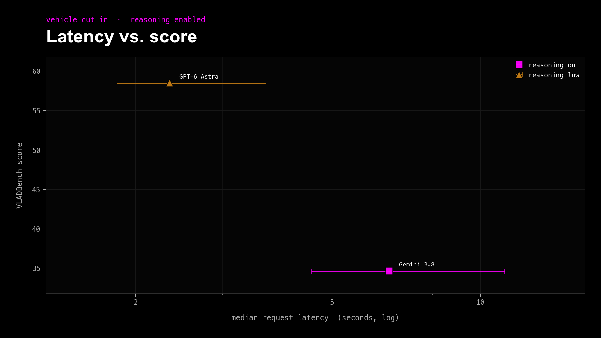

# Vehicle_Cutin Leaderboard (cut-in reword)

These are the results from the corrected Vehicle Cut-in sweep. The prompt asks whether the target vehicle intends to “cut in (enter or cross into the ego vehicle’s path).” Official-wording runs live in `LEADERBOARD.md`.

### All completed runs

> **Note:**
>
> - Generated from `output/Vehicle_Cutin`.
> - Official scoring weights: judgment 70%, reason 10%, instruction following 20%.
> - Scores are based on a shared 260-question set; `JAAD_video__0246 q3` is excluded from every run.
> - Use the [scoring explorer](scoring-explorer.html) to adjust the weights.

| Rank | Model | Reasoning | Status | Score | Judgment | Reason | Obey | Wall time | Median request | Reasoning tokens |
| ---: | --- | --- | --- | ---: | ---: | ---: | ---: | ---: | ---: | ---: |
| 1 | Qwen/Qwen3.6-35B-A3B-FP8 | Disabled | 260/260 | 71.10 | 71.8% | 8.1% | 100.0% | 2m 2.3s | 1.2s | 0 |
| 2 | Qwen/Qwen3.6-35B-A3B | Disabled | 260/260 | 66.56 | 65.5% | 7.0% | 100.0% | 1m 59.6s | 1.1s | 0 |
| 3 | openai/gpt-6-astra | Low | 260/260 | 58.47 | 52.3% | 18.6% | 100.0% | 3m 24.3s | 2.3s | 3,209 |
| 4 | google/gemini-3.8-flash | Enabled | 260/260 | 34.66 | 18.4% | 18.6% | 99.6% | 9m 40.1s | 6.5s | 190,323 |
| 5 | with-feedback-fp8 (fine-tuned) | Disabled | 260/260 | 26.68 | 8.0% | 10.5% | 100.0% | 1m 26.3s | 1.0s | — |

## Median Request Latency vs. Score

Completed runs with per-request timing metadata only; horizontal bars show the p25–p75 request-latency range and the x-axis is logarithmic. Qwen 3.8 runs are omitted because their legacy outputs lack request timing metadata.

### Reasoning disabled

### Reasoning enabled

