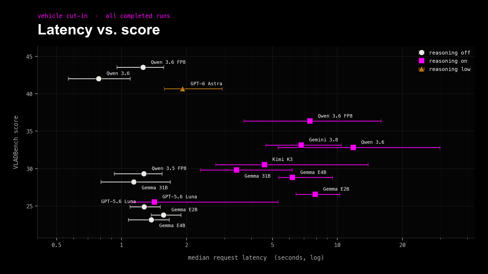
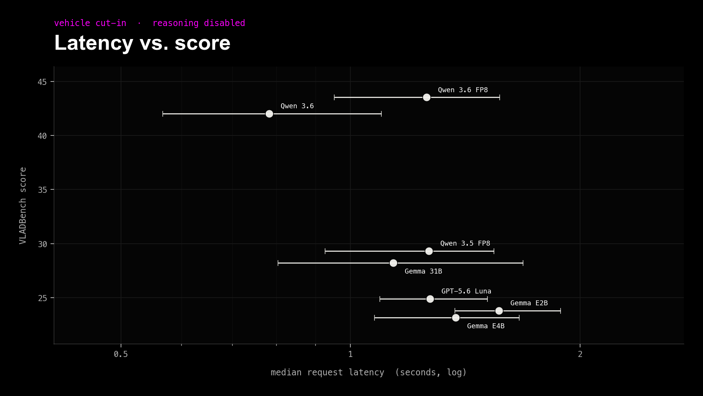
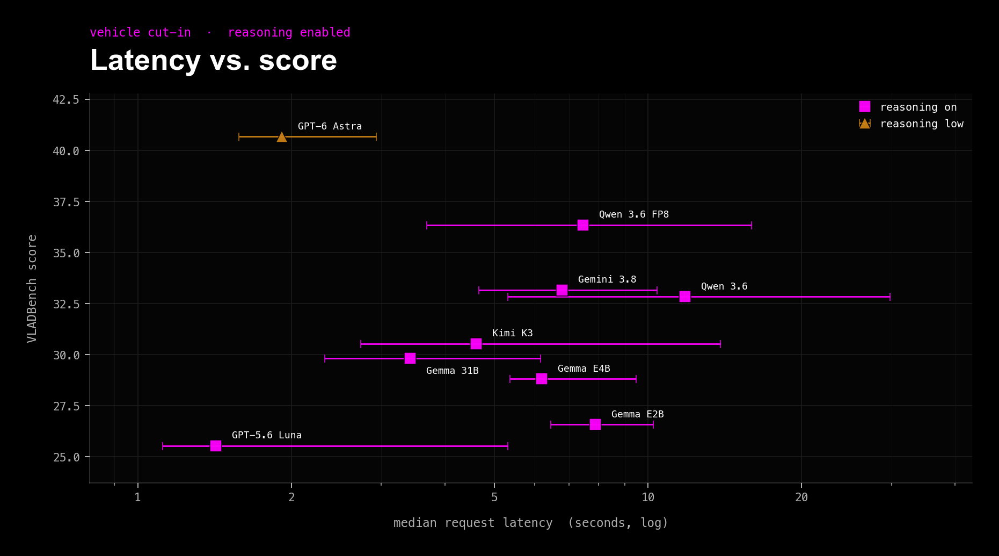

# Vehicle_Cutin Leaderboard

These are the results from the original Vehicle Cut-in sweep using the official VLAD wording: “intention to cross the road”. Reworded runs live in `LEADERBOARD-reword.md`.

### All completed runs

> **Note:**
>
> - Generated from `output/Vehicle_Cutin`.
> - Official scoring weights: judgment 70%, reason 10%, instruction following 20%.
> - Scores are based on a shared 260-question set; `JAAD_video__0246 q3` is excluded from every run.
> - Use the [scoring explorer](scoring-explorer.html) to adjust the weights.

| Rank | Model | Reasoning | Status | Score | Judgment | Reason | Obey | Wall time | Median request | Reasoning tokens |
| ---: | --- | --- | --- | ---: | ---: | ---: | ---: | ---: | ---: | ---: |
| 1 | Qwen/Qwen3.6-35B-A3B-FP8 | Disabled | 260/260 | 43.52 | 31.6% | 14.0% | 100.0% | 1m 59.6s | 1.3s | 0 |
| 2 | Qwen/Qwen3.6-35B-A3B | Disabled | 260/260 | 42.03 | 29.3% | 15.1% | 100.0% | 1m 6.4s | 0.8s | 0 |
| 3 | openai/gpt-6-astra | Low | 260/260 | 40.66 | 25.9% | 25.6% | 100.0% | 12m 37.2s | 1.9s | 2,979 |
| 4 | Qwen/Qwen3.6-35B-A3B-FP8 | Enabled | 260/260 | 36.34 | 20.7% | 18.6% | 100.0% | 24m 18.5s | 7.5s | 751,984 |
| 5 | google/gemini-3.8-flash | Enabled | 260/260 | 33.15 | 15.5% | 24.4% | 99.2% | 16m 38.2s | 6.8s | 225,080 |
| 6 | Qwen/Qwen3.6-35B-A3B | Enabled | 260/260 | 32.83 | 16.7% | 11.6% | 100.0% | 58m 47.7s | 11.8s | 662,351 |
| 7 | Qwen/Qwen3.8-27B | Enabled | 260/260 | 31.92 | 14.4% | 18.6% | 100.0% | 22m 30.6s | — | — |
| 8 | moonshotai/Kimi-K3 | Enabled | 260/260 | 30.53 | 13.2% | 12.8% | 100.0% | 15m 33.3s | 4.6s | 403,723 |
| 9 | google/gemma-4-31B-it | Enabled | 260/260 | 29.81 | 12.1% | 17.4% | 98.1% | 19m 51.7s | 3.4s | 165,930 |
| 10 | Qwen/Qwen3.5-35B-A3B-FP8 | Disabled | 260/260 | 29.33 | 11.5% | 12.8% | 100.0% | 1m 35.6s | 1.3s | 0 |
| 11 | google/gemma-4-E4B-it | Enabled | 260/260 | 28.81 | 10.9% | 11.6% | 100.0% | 8m 21.4s | 6.2s | 153,690 |
| 12 | google/gemma-4-31B-it | Disabled | 260/260 | 28.23 | 9.8% | 14.0% | 100.0% | 7m 20.7s | 1.1s | 0 |
| 13 | google/gemma-4-E2B-it | Enabled | 260/260 | 26.57 | 6.9% | 17.4% | 100.0% | 9m 48.5s | 7.9s | 129,789 |
| 14 | with-feedback-fp8 (fine-tuned) | Disabled | 260/260 | 26.46 | 6.9% | 16.3% | 100.0% | 1m 23.2s | 0.9s | — |
| 15 | Qwen/Qwen3.8-27B | Disabled | 260/260 | 26.22 | 6.9% | 14.0% | 100.0% | 2m 46.8s | — | — |
| 16 | with-feedback-fp8 (fine-tuned) | Enabled | 260/260 | 25.66 | 7.5% | 12.8% | 95.8% | 14m 45.0s | 4.2s | — |
| 17 | openai/gpt-5.6-luna | Enabled | 260/260 | 25.53 | 5.7% | 15.1% | 100.0% | 14m 49.8s | 1.4s | 31,185 |
| 18 | openai/gpt-5.6-luna | Disabled | 260/260 | 24.90 | 5.2% | 12.8% | 100.0% | 7m 44.0s | 1.3s | 0 |
| 19 | google/gemma-4-E2B-it | Disabled | 260/260 | 23.81 | 3.4% | 14.0% | 100.0% | 1m 55.5s | 1.6s | 0 |
| 20 | google/gemma-4-E4B-it | Disabled | 260/260 | 23.17 | 2.9% | 11.6% | 100.0% | 1m 43.4s | 1.4s | 0 |
| — | Qwen/Qwen3.5-0.8B | Enabled | Running (29/260) | — | — | — | — | — | 2.9s | 18,882 |
| — | Qwen/Qwen3.5-35B-A3B-FP8 | Enabled | Blocked (259/260) | — | — | — | — | — | 9.1s | 826,107 |
| — | google/gemma-4-26B-A4B-it | Enabled | DNF (256/260) | — | — | — | — | — | 10.6s | 247,783 |
| — | zai-org/GLM-5.3-Flash | Enabled | DNF (175/260) | — | — | — | — | — | 6.1s | 166,220 |

## Median Request Latency vs. Score

Completed runs with per-request timing metadata only; horizontal bars show the p25–p75 request-latency range and the x-axis is logarithmic. Qwen 3.8 runs are omitted because their legacy outputs lack request timing metadata.

### Reasoning disabled

### Reasoning enabled

